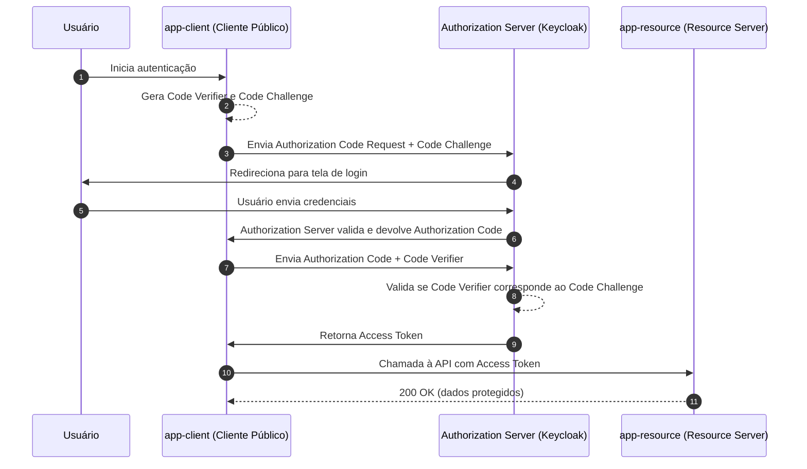

# 🔐 Fluxo Code Flow com PKCE

Este projeto demonstra a utilização do **Authorization Code Flow com PKCE (Proof Key for Code Exchange)** entre duas aplicações, utilizando autenticação via **OAuth 2.0 / OpenID Connect**.

## 📌 O que é o Code Flow com PKCE?

O **Authorization Code Flow** é um dos fluxos de autenticação mais seguros do OAuth 2.0. Ele permite que um cliente (ex.: `app-client`) obtenha um **código de autorização** junto ao servidor de identidade (ex.: Keycloak) e o troque por um **token de acesso**. Esse token pode então ser utilizado para consumir recursos protegidos em outra aplicação (ex.: `app-resource`).

O **PKCE (Proof Key for Code Exchange)** adiciona uma camada extra de segurança, exigindo que o cliente gere um **código de verificação** (`code_verifier`) e um **desafio criptográfico** (`code_challenge`). Assim, mesmo que o código de autorização seja interceptado, ele não poderá ser reutilizado sem o `code_verifier` correto.

---

👉 Ou seja: o **app-client** autentica o usuário no Keycloak, obtém o token e o utiliza para acessar a API do **app-resource** em segurança.

### 🔐 Authorization Code Flow com PKCE 

> 💡 **Observações**
>
> * O **Authorization Server (AS)** ou **Identity Provider (IdP)**  emite um `authorization code` — um _“ticket”_ de uso único, vinculado ao cliente (e ao redirect_uri), com validade curta (30–60 segundos).

> * No PKCE, o `code verifier` é uma string aleatória e secreta gerada no cliente. O `code challenge` é derivado do code verifier — normalmente `BASE64URL(SHA-256(verifier))`.

> * **COM PKCE** o `client_secret` fica no Authorization Server.

> * **SEM PKCE** o `client_secret` fica no Client.
