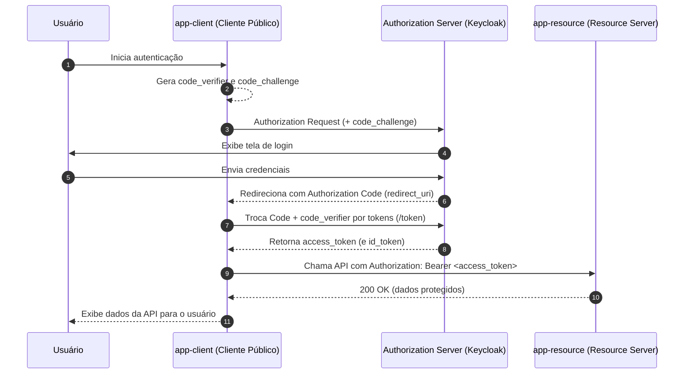

# 🔐 Fluxo Code Flow com PKCE

Este projeto demonstra a utilização do **Authorization Code Flow com PKCE (Proof Key for Code Exchange)** entre duas aplicações, utilizando autenticação via **OAuth 2.0 / OpenID Connect**.

## 📌 O que é o Code Flow com PKCE?

O **Authorization Code Flow** é um dos fluxos de autenticação mais seguros do OAuth 2.0. Ele permite que um cliente (ex.: `app-client`) obtenha um **código de autorização** junto ao servidor de identidade (ex.: Keycloak) e o troque por um **token de acesso**. Esse token pode então ser utilizado para consumir recursos protegidos em outra aplicação (ex.: `app-resource`).

O **PKCE (Proof Key for Code Exchange)** adiciona uma camada extra de segurança, exigindo que o cliente gere um **código de verificação** (`code_verifier`) e um **desafio criptográfico** (`code_challenge`). Assim, mesmo que o código de autorização seja interceptado, ele não poderá ser reutilizado sem o `code_verifier` correto.

---

👉 Ou seja: o **app-client** autentica o usuário no Keycloak, obtém o token e o utiliza para acessar a API do **app-resource** em segurança.

### 🔐 Authorization Code Flow com PKCE 


```mermaid
sequenceDiagram
  autonumber
  participant U as Usuário
  participant C as app-client (Cliente Público)
  participant AS as Authorization Server (Keycloak)
  participant R as app-resource (Resource Server)

  U->>C: Inicia autenticação
  C-->>C: Gera code_verifier e code_challenge
  C->>AS: Authorization Request (+ code_challenge)
  AS->>U: Exibe tela de login
  U->>AS: Envia credenciais
  AS-->>C: Redireciona com Authorization Code (redirect_uri)
  C->>AS: Troca Code + code_verifier por tokens (/token)
  AS-->>C: Retorna access_token (e id_token)
  C->>R: Chama API com Authorization: Bearer <access_token>
  R-->>C: 200 OK (dados protegidos)
  C-->>U: Exibe dados da API para o usuário

```

1. Usuário inicia login no app-client.
2. O Keycloak (AS) autentica e devolve o código.
3. O app-client troca por token.
4. Com o access_token, o app-resource responde.
5. O app-client apresenta os dados ao usuário.

> 💡 **Observações**
>
> * O **Authorization Server (AS)** ou **Identity Provider (IdP)**  emite um `authorization code` — um _“ticket”_ de uso único, vinculado ao cliente (e ao redirect_uri), com validade curta (30–60 segundos).

> * No PKCE, o `code verifier` é uma string aleatória e secreta gerada no cliente. O `code challenge` é derivado do code verifier — normalmente `BASE64URL(SHA-256(verifier))`.

> * **COM PKCE** o `client_secret` fica no Authorization Server.

> * **SEM PKCE** o `client_secret` fica no Client.


---

## 🌍 Serviços e Portas

### 🔑 Keycloak

* **Service:** `keycloak`
* **Issuer:** `http://keycloak:8080/realms/app-pks-realm`
* **UI/Admin:** [http://keycloak:8080/](http://keycloak:8080/)
* **health/ready:** [http://keycloak:9000/health/ready](http://keycloak:9000/health/ready)

### 🖥️ PKCE Client

* **Service:** `app-client`
* **Porta:** `8081:8081`
* **URL:** [http://localhost:8081](http://localhost:8081)

### 🔒 Resource Server

* **Service:** `app-resource`
* **Porta:** `8082:8082`
* **URL:** [http://localhost:8082](http://localhost:8082)

---


## ▶️ Como Rodar?

### 1. Subir os containers com Docker Compose

```sh
docker compose up -d
```

### 2. Acessar as aplicações

* 🌐 **Keycloak (Admin UI):** [http://localhost:8080](http://localhost:8080)
* 👤 **Login no app-client:** acesse [http://localhost:8081](http://localhost:8081)

  * Usuário: `appclient`
  * Senha: `appclient`

Após o login, o **app-client** redireciona para o **Keycloak** para autenticação.
Depois do login bem-sucedido, retorna ao **app-client**, onde é possível clicar em **Chamar API Protegida**.

O **app-client** usará o **Access Token** obtido no Keycloak para consumir a API protegida do **app-resource** em [http://localhost:8082](http://localhost:8082).
