# 🔐 Fluxo Code Flow com PKCE

Este projeto demonstra a utilização do **Authorization Code Flow com PKCE (Proof Key for Code Exchange)** entre duas aplicações, utilizando autenticação via **OAuth 2.0 / OpenID Connect**.

## 📌 O que é o Code Flow com PKCE?

O **Authorization Code Flow** é um dos fluxos de autenticação mais seguros do OAuth 2.0. Ele permite que um cliente (ex.: `app-client`) obtenha um **código de autorização** junto ao servidor de identidade (ex.: Keycloak) e o troque por um **token de acesso**. Esse token pode então ser utilizado para consumir recursos protegidos em outra aplicação (ex.: `app-resource`).

O **PKCE (Proof Key for Code Exchange)** adiciona uma camada extra de segurança, exigindo que o cliente gere um **código de verificação** (`code_verifier`) e um **desafio criptográfico** (`code_challenge`). Assim, mesmo que o código de autorização seja interceptado, ele não poderá ser reutilizado sem o `code_verifier` correto.

---

👉 Ou seja: o **app-client** autentica o usuário no Keycloak, obtém o token e o utiliza para acessar a API do **app-resource** em segurança.

### 🔐 Authorization Code Flow com PKCE 

```mermaid
sequenceDiagram
  autonumber
  participant U as Usuário
  participant C as app-client (Cliente Público)
  participant AS as Authorization Server (Keycloak)
  participant R as app-resource (Resource Server)

  U->>C: Inicia autenticação
  C-->>C: Gera code_verifier e code_challenge (S256)
  C->>AS: /authorize?response_type=code&client_id=...&redirect_uri=...&scope=openid...&state=...&code_challenge=...&code_challenge_method=S256
  AS->>U: Exibe tela de login (e consentimento se aplicável)
  U->>AS: Envia credenciais
  AS-->>C: Redireciona para redirect_uri com ?code=...&state=...
  C->>AS: POST /token (grant_type=authorization_code, code, redirect_uri, code_verifier)
  AS-->>C: Retorna tokens (access_token, id_token[, refresh_token])
  C->>R: GET/POST ... com Authorization: Bearer <access_token>
  R-->>C: 200 OK (dados protegidos)
```

> 💡 **Observações**
>
> * O **Authorization Server (AS)** ou **Identity Provider (IdP)**  emite um `authorization code` — um _“ticket”_ de uso único, vinculado ao cliente (e ao redirect_uri), com validade curta (30–60 segundos).

> * No PKCE, o `code verifier` é uma string aleatória e secreta gerada no cliente. O `code challenge` é derivado do code verifier — normalmente `BASE64URL(SHA-256(verifier))`.

> * **COM PKCE** o `client_secret` fica no Authorization Server.

> * **SEM PKCE** o `client_secret` fica no Client.
